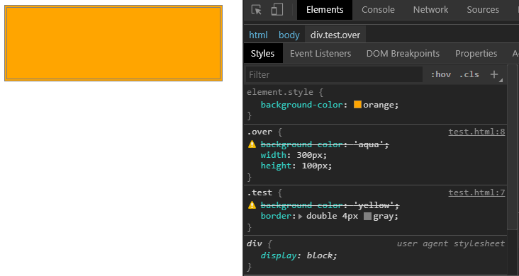
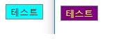
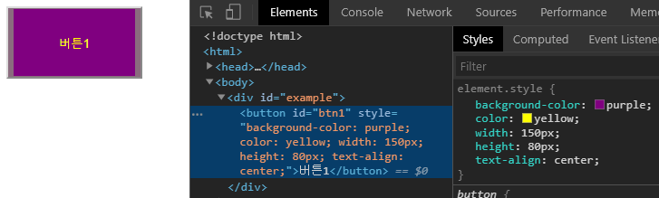
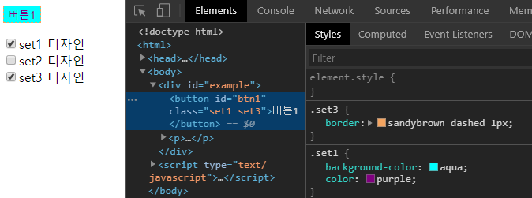
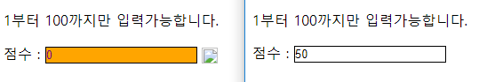
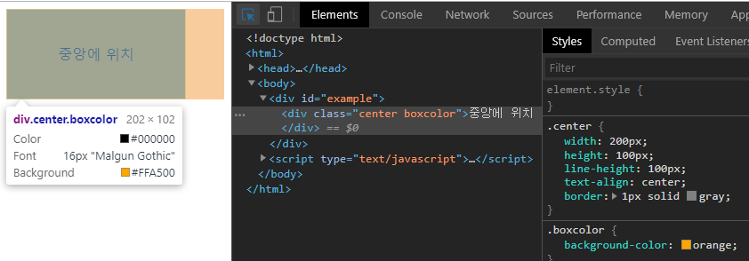
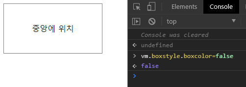
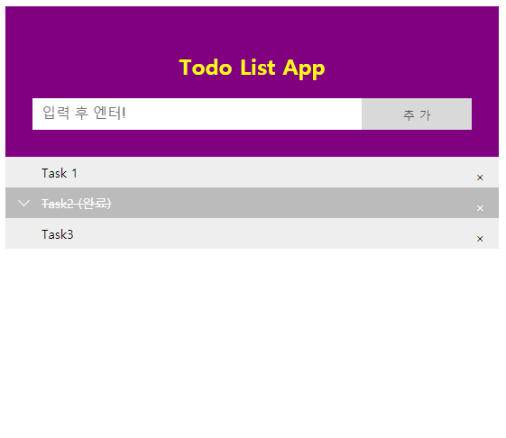

# 05 스타일


### 목차<br>
> [5.1 스타일 적용](#스타일-적용)<br>
> [5.2 인라인 스타일](#인라인-스타일)<br>
> [5.3 CSS 클래스 바인딩](#css-클래스-바인딩)<br>
> [5.4 계산형 속성과 메서드를 이용한 스타일 적용](#계산형-속성과-메서드를-이용한-스타일-적용)<br>
> [5.5 컴포넌트에서의 스타일 적용](#컴포넌트에서의-스타일-적용)<br>
> [5.6 TodoList 예제](#todolist-예제)<br>


## 스타일 적용
우리는 웹 애플리케이션을 개발할때 UI를 디자인하기 위해서 스타일(style) 특성(Attribute)과 CSS 클래스를 밀접하게 사용해왔다. 그리고 HTML 요소의 스타일 속성은 모두 문자열로 이루어져있고 케밥 표기법을 사용한다. (ex: font-size / background-color 등)
이 표기법을 사용하는 이유는 HTML에서는 대소문자를 구별하지 않기 때문이다.

```html
<style>
   .test{background-color:aqua; color:brown; border:1px solid black;}
</style>
<button class="test">버튼 1</button>
<button class="test">버튼 2</button>
<button class="test">버튼 3</button>
````

각 요소마다 일일히 스타일을 직접 입혀주는 건 정말 비효율적인 일이라 미리 `CSS 클래스를 지정하고 이를 HTML요소에 바인딩 하는 방법을 사용`해왔다. 바로 위에 있는 예제처럼 말이다. 그리고 적용되는 순서는 꼭 알아둘 필요가 있다.

**[ 예제 05-01 ]**
<a href="https://jsfiddle.net/Hanseulgi/fmht8ca9/" target="_blank">https://jsfiddle.net/Hanseulgi/fmht8ca9/</a>
```html
<!DOCTYPE html>
<html>
<head>
  <meta charset="utf-8">
  <title>05-01</title>
  <style>
    .test{background-color:yellow; border:4px double gray;}
    .over{background-color:aqua; width:300px; height:100px;}
  </style>
</head>
<body>
    <div class="test over" style="background-color:orange;"></div>
</body>
</html>
```



실행 결과를 살펴보면 <style></style> 태그에 작성된 순서대로 CSS 클래스의 스타일이 적용된 후 HTML 요소에 style 특성(Attribute)을 이용한 인라인 스타일이 적용된다. 만약 이 예제에서와 같이 동일한 스타일 속성이 주어진다면 마지막에 적용된 스타일 속성이 적용되고 나머지는 적용되지 않는다.


## 인라인 스타일


기존 HTML 에서는 인라인 스타일(HTML 요소의 style 프로퍼티에 CSS를 기술하는 방식)의 사용을 권장하지 않았다. **Vue.js**에서도 마찬가지다. 가능하다면 인라인 스타일을 사용하지 않는것이 바람직하지만 인라인 스타일이 필요한 경우도 있으니 사용방법은 알아둬야 한다.

인라인 스타일은 v-bind:style로 작성한다. style로 지정할 정보는 데이터 속성에 작성한다. 데이터 속성 작성 시 주의사항은 스타일 속성을 케밥 표기법이 아닌 카멜 표기법으로 사용해야 한다는 점이다. 또한 스타일 속성과 속성에는 세미콜론(;)이 아닌 콤마(,) 기호를 이용해 구분한다.

> *여기서 잠깐 ! 코딩 시 명명법 (표기법)*
>> 카멜(Camel) 표기법 : inlineStyle<br>
>> 파스칼(pascal) 표기법 : InlineStyle<br>
>> 스네이크(snake) 표기법 : inline_style<br>
>> 케밥(Kebab) 표기법 : inline-style


Vue 인스턴스의 데이터로 처리하려면 케밥 표기법을 사용할 수 없다.
사실 이와 같은 관습은 자바스크립트에서도 사용되어 왔다.

- document.getElementById("a").Style.fontSize='20px';

**[ 예제 05-02 ]**
<a href="https://jsfiddle.net/Hanseulgi/awnczyx6/" target="_blank">https://jsfiddle.net/Hanseulgi/awnczyx6/</a>
```html
<!DOCTYPE html>
<html>
<head>
  <meta charset="utf-8">
  <title>05-02</title>
  <script src="https://unpkg.com/vue@2.5.16/dist/vue.js"></script>
</head>
<body>
<div id="example">
  <button id="a" v-bind:style="style1" @mouseover.stop="overEvent" 
      @mouseout.stop="outEvent">테스트</button>
</div>
<script type="text/javascript">
var vm = new Vue({
  el : "#example",
  data : {
    style1 : { backgroundColor:"aqua", border:'solid 1px gray', 
      with:'100px', textAlign:'center' }
  },
  methods : {
    overEvent : function(e) {
      this.style1.backgroundColor = "purple";
      this.style1.color = "yellow";
    },
    outEvent : function(e) {
      this.style1.backgroundColor = "aqua";
      this.style1.color = "black";
    }
  }
})
</script>
</body>
</html>
```


실행결과를 살펴보면 왼쪽이 mouseout 이벤트가, 오른쪽이 mouseover 이벤트가 사용되었음을 알 수 있다. 버튼에 마우스가 over나 out될 때 아래 style1 데이터 속성을 변경한다.

```javascript
style1 : { backgroundColor:"aqua", border:'solid 1px gray', 
      with:'100px', textAlign:'center' }
```

변경된 속성은 v-bind:style="style1"을 통해 바인딩 됨을 알 수 있다.

```html
<button id="a" v-bind:style="style1" @mouseover.stop="overEvent" @mouseout.stop="outEvent">테스트</button>
```

style1 데이터 속성을 살펴보면 backgroundColor와 textAlign과 같이 카멜 표기법을 사용하면서 자바스크립트 객체 표기법을 사용하고 있음을 알 수 있다.
그리고 v-bind:style 디렉티브를 통해서 개별적인 속성 하나하나를 바인딩 할 수도 있는데 한번 살펴보자.

**[ 예제 05-03 ]**
<a href="https://jsfiddle.net/Hanseulgi/qm5wth72/" target="_blank">https://jsfiddle.net/Hanseulgi/qm5wth72/</a>
```html
<!DOCTYPE html>
<html>
<head>
  <meta charset="utf-8">
  <title>05-03</title>
  <script src="https://unpkg.com/vue@2.5.16/dist/vue.js"></script>
</head>
<body>
<div id="example">
  <div 
    :style="{ backgroundColor: a.bc, border:a.bd, width:a.w+'px', height:a.h+'px' }">
  </div>
</div>
<script type="text/javascript">
var vm = new Vue({
  el : "#example",
  data : {
    a : { bc:"yellow", bd:'solid 1px gray', w:200, h:100 }
  }
})
</script>
</body>
</html>
```

위 방법은 추천하지 않는 방법이다. 이유는 **유지보수가 힘들다.** 가능하면 스타일 객체를 직접 바인딩하는 [ 예제 05-02 ]방법을 추천한다. `스타일 객체를 사용할때는 한 번에 여러 개의 스타일 객체를 바인딩 할 수 있다`는 사실은 자주 사용할 것 같지는 않지만 알아두면 도움이 된다.

**[ 예제 05-04 ]**
<a href="https://jsfiddle.net/Hanseulgi/so5wj6bt/" target="_blank">https://jsfiddle.net/Hanseulgi/so5wj6bt/</a>
```html
<!DOCTYPE html>
<html>
<head>
  <meta charset="utf-8">
  <title>05-04</title>
  <script src="https://unpkg.com/vue@2.5.16/dist/vue.js"></script>
</head>
<body>
<div id="example">
    <button id="btn1" v-bind:style="[myColor,myLayout]">버튼1</button>
</div>
<script type="text/javascript">
var vm = new Vue({
  el : "#example",
  data : {
    myColor : { backgroundColor:'purple', color:'yellow' },
    myLayout : { width:'150px', height:'80px', textAlign:'center' }
  }
})
</script>
</body>
</html>
```


[ 예제 05-04 ]에서는 두개의 데이터 속성을 준비했는데, 이것들이 적용할 스타일 객체이다. 

```html
<button id="btn1" v-bind:style="[myColor,myLayout]">버튼1</button>
```

이 부분에서 **myColor, myLayout** 스타일 객체를 배열 구조를 이용해서 적용하고 있다.
실제로 버튼에 두 스타일 객체의 속성이 모두 적용되었음을 알 수 있다.


## css 클래스 바인딩

CSS 클래스를 바인딩 하기 위해서는 **v-bind:class**를 사용한다. 이때 개별적인 클래스 단위로 **true**가 되면 클래스가 주어진다.

**[ 예제 05-05 ]**
<a href="https://jsfiddle.net/Hanseulgi/zrhe0cn8/" target="_blank">https://jsfiddle.net/Hanseulgi/zrhe0cn8/</a>
```html
<!DOCTYPE html>
<html>
<head>
  <meta charset="utf-8">
  <title>05-05</title>
  <style>
    .set1 { background-color: aqua; color:purple; }
    .set2 { text-align:center; width:120px; }
    .set3 { border:sandybrown dashed 1px; }
  </style>
  <script src="https://unpkg.com/vue@2.5.16/dist/vue.js"></script>
</head>
<body>
<div id="example">
    <button id="btn1" v-bind:class="{ set1:s1, set2:s2, set3:s3 }">버튼1</button>
    <p>
        <input type="checkbox" v-model="s1" value="true" />set1 디자인<br/>
        <input type="checkbox" v-model="s2" value="true" />set2 디자인<br/>
        <input type="checkbox" v-model="s3" value="true" />set3 디자인<br/>
    </P>
</div>
<script type="text/javascript">
var vm = new Vue({
  el : "#example",
  data : { s1 : false, s2 : false, s3 : false }
})
</script>
</body>
</html>
```


**v-bind:class**를 이용해서 클래스를 적용할 때는 `boolean값(true/false)`를 이용해 지정한다. 
 
```javascript
data : { s1 : false, s2 : false, s3 : false }
```
위 부분이 boolean값이다. 이 값은 아래 부분의 체크박스에 `v-model 디렉티브`를 이용해 **양방향 바인딩**되어 있다. 
```html
<input type="checkbox" v-model="s1" value="true" />set1 디자인<br/>
<input type="checkbox" v-model="s2" value="true" />set2 디자인<br/>
<input type="checkbox" v-model="s3" value="true" />set3 디자인<br/>
```

체크가 되면 데이터 속성 값이 ture로 변경된다. 이 값은 아래와 같은 형태로 각각 클래스 지정 여부를 결정하게 된다.

```html
<button id="btn1" v-bind:class="{ set1:s1, set2:s2, set3:s3 }">버튼1</button>
```

하지만 역시나 개별적인 값을 지정해주는 것은 불편하다. 그 불편함을 해결하는 방법은 아래 예제에서 살펴볼 수 있는데 클래스 이름을 데이터 속성명으로 사용하면 이런 불편함을 없앨 수 있다.

**[ 예제 05-06 ]**
<a href="https://jsfiddle.net/Hanseulgi/rva6k9ew/" target="_blank">https://jsfiddle.net/Hanseulgi/rva6k9ew/</a>
```html
<!DOCTYPE html>
<html>
<head>
  <meta charset="utf-8">
  <title>05-06</title>
  <style>
    .set1 { background-color: aqua; color:purple; }
    .set2 { text-align:center; width:120px; }
    .set3 { border:sandybrown dashed 1px; }
  </style>
  <script src="https://unpkg.com/vue@2.5.16/dist/vue.js"></script>
</head>
<body>
<div id="example">
    <button id="btn1" v-bind:class="mystyle">버튼1</button>
    <p>
        <input type="checkbox" v-model="mystyle.set1" value="true" />set1 디자인<br/>
        <input type="checkbox" v-model="mystyle.set2" value="true" />set2 디자인<br/>
        <input type="checkbox" v-model="mystyle.set3" value="true" />set3 디자인<br/>
    </P>
</div>
<script type="text/javascript">
var vm = new Vue({
  el : "#example",
  data : { 
     mystyle : { set1:false, set2:false, set3:false }
  }
})
</script>
</body>
</html>
```

[ 예제 05-05 ]와는 어떤 차이가 있을까?<br> 적용할 클래스명을 포함하는 **mystyle**이라는 이름의 데이터 속성을 가진 객체를 작성했다. 그리고 **mystyle**이라는 객체를 바인딩한다. [ 예제 05-05 ]와 비교해보자.<br><br> 
[ 예제 05-05 ]
```html
<button id="btn1" v-bind:style="[myColor,myLayout]">버튼1</button>
```
```javascript
data : { s1 : false, s2 : false, s3 : false }
```
[ 예제 05-06 ]
```html
<button id="btn1" v-bind:class="mystyle">버튼1</button>
```
```javascript
data : { 
   mystyle : { set1:false, set2:false, set3:false }
}
```

mystyle 객체의 속성들은 style명을 그대로 사용한다. 이 속성이 true면 css 클래스가 추가되고 false면 css 클래스가 추가되지 않는다. **확실히 개별적인 값을 지정해주는 것보다 이렇게 하나의 데이터 속성을 가진 객체로 만들고 바인딩 시켜주는 것이 더 효율적**이다.


## 계산형 속성과 메서드를 이용한 스타일 적용

우리는 3장 Vue 인스턴스에서 계산형 속성(computed property)을 다룬 적이 있다. 앞서 다룬 3장에서는 연산 로직이 필요할 경우 계산형 속성을 사용해서 필요한 함수를 등록했었다. 5장에서는 `계산형 속성은 스타일을 적용할때도 사용할 수 있다는 점`을 이야기하고자 한다. 아래 예제는 **입력 값이 올바른 범위에 포함 되지 않을 때 스타일을 적용하는 예제**이다. 계산형 속성을 이용해 처리해보자.


**[ 예제 05-07 ]**
<a href="https://jsfiddle.net/Hanseulgi/0c92hkrb/" target="_blank">https://jsfiddle.net/Hanseulgi/0c92hkrb/</a>
```html
<!DOCTYPE html>
<html>
<head>
  <meta charset="utf-8">
  <title>05-07</title>
  <style>
    .score { border:solid 1px black; }
    .warning { background-color: orange; color:purple; }
    .warnimage { width:18px; height:18px; top:5px; position:relative; }
  </style>
  <script src="https://unpkg.com/vue@2.5.16/dist/vue.js"></script>
</head>
<body>
<div id="example">
    <div>
        <p>1부터 100까지만 입력가능합니다.</p>
        <div>
            점수 : <input type="text" class="score" v-model.number="score" v-bind:class="info" />
            
        </div>
    </div>
</div>
<script type="text/javascript">
var vm = new Vue({
  el : "#example",
  data : { 
    score : 0
  },
  computed : {
    info : function() {
        if (this.score >= 1 && this.score <= 100) 
            return { warning:false };
        else 
            return { warning:true };
    }
  }
})
</script>
</body>
</html>
```



score가 1부터 100까지일때만 유효한 값으로 판단한다. 

```javascript
data : { 
    score : 0
},
```

score라는 데이터 속성은 input 요소에 양방향 바인딩 되어있다.

```html
점수 : <input type="text" class="score" v-model.number="score" v-bind:class="info" />
```

input 요소에 입력한 값은 score에 설정되고 **v-bind:class="info"**에 의해 info 계산형 속성이 바인딩된다. info 계산형 속성은 score 값의 범위에 따라서 true 또는 false를 리턴한다.

```javascript
if (this.score >= 1 && this.score <= 100) 
    return { warning:false };
else 
    return { warning:true };
```

이 값에 의해 warnimg 클래스의 지정 여부가 결정되는 것이다.

계산형 속성과 같은 방식으로 메서드를 이용할 수도 있다.
메서드가 **{ [클래스명]:[true/false] }** 형태로 값을 리턴한다면 가능하다.


> *여기서 잠깐 ! computed와 methods 간단하게 알아보기*

| **computed** | **methods** |
|---|---|
| 함수로 정의하고 data객체 등을 사용하여 계산된 값을 리턴해 줌 | 함수로 정의하고 data객체 등을 사용하여 계산된 값을 리턴해 줌 |
| data 속성에 변화가 있을때 자동으로 다시 연산(동일한 요청이 또 올 경우는 함수를 실행하지 않고 캐싱된 값만 리턴) | 캐싱이라는 개념이 없기 때문에 매번 재 렌더링(호출될때마다 계속 함수를 실행) |

> *그 외 다른 Vue인스턴스 간단하게 알아보기*

| **el** | **data** | **watch** |
|---|---|---|
| Vue가 실행될 HTML의 DOM 요소를 지정(CSS의 선택자를 선택하듯이 선택 (#--> id 지정, . --> 클래스 지정)| Vue가 바라보는 data 객체를 지정(직접 객체를 작성해도 되고 미리 선언된 객체변수를 작성해도 됨)|지정된 변수를 계속 지켜보고 있다가 값이 변경되었을때 정의된 함수를 실행시킴(관찰하고자 하는 지정된 변수, 긴 시간이 필요한 비동기 처리가 필요할 경우 주로 사용)|


## 컴포넌트에서의 스타일 적용

Vue 컴포넌트에서 스타일 적용방법을 살펴보겠다. Vue 컴포넌트는 아직 배우지 않은 내용이지만 스타일에 국한된 방법이라면 크게 어렵지 않게 알 수 있다. 간단한 컴포넌트는 **Vue.component()**를 이용해 작성할 수 있다. 

```html
<div id="exaple">
    <center-box></conter-box>
</div>
.....
Vue.component('center-box', {
    template : '<div class="center">중앙에 위치</div>'
})
```

center-box라는 이름의 Vue 컴포넌트를 작성해봤다. 이것은 `<center-box></conter-box>`와 같이 사용할 수 있다. 이미 이 컴포넌트에도 클래스가 적용되어 있지만 추가로 클래스를 바인딩할 수 있다.


**[ 예제 05-08 ]**
<a href="https://jsfiddle.net/Hanseulgi/py8oc4xn/" target="_blank">https://jsfiddle.net/Hanseulgi/py8oc4xn/</a>
```html
<!DOCTYPE html>
<html>
<head>
  <meta charset="utf-8">
  <title>05-08</title>
  <style>
    .boxcolor { background-color:orange; }
    .center { width:200px; height:100px; line-height: 100px; text-align: center; border: 1px solid gray; }
  </style>
  <script src="https://unpkg.com/vue@2.5.16/dist/vue.js"></script>
</head>
<body>
<div id="example">
    <center-box v-bind:class="boxstyle"></center-box>
</div>
<script type="text/javascript">
Vue.component('center-box', {
    template : '<div class="center">중앙에 위치</div>'
})
var vm = new Vue({
    el : "#example",
    data : {
       boxstyle : { boxcolor : true }
    }
})
</script>
</body>
</html>
```



```css
.center { width:200px; height:100px; line-height: 100px; text-align: center; border: 1px solid gray; 
```
이 클래스는 Vue 컴포넌트의 template 내부에 이미 적용되어 있다.

```css
.boxcolor { background-color:orange; } 
```
이 클래스는 Vue 인스턴스의 boxstyle 데이터 속성값에 의해 적용 여부를 결정할 수 있도록 

```html
<center-box v-bind:class="boxstyle"></center-box>
```
**v-bind 디렉티브를 사용**한다. 브라우저의 [개발자도구]->[Console]에서 `vm.boxstyle.boxcolor=false` 구문을 실행하면 즉시 색상이 바뀔 것이다. 

**[ Console ]**<br>



이렇듯 간단한 방법을 사용해 컴포넌트 단위에 대해서도 클래스와 스타일을 적용할 수 있다.

## todolist 예제

이제 1장부터 5장까지 학습한 내용을 바탕으로 간단한 예제를 작성해보겠다. 바로 **TodoList**앱이다. 간단히 할 목록을 작성하고 `저장, 삭제, 완료 처리를 할 수 있는 기능을 제공`한다. 일단 마크업을 작성해보자.

**[ 예제 05-09 ]**
<a href="https://jsfiddle.net/Hanseulgi/14b9wLeg/1/" target="_blank">https://jsfiddle.net/Hanseulgi/14b9wLeg/1/</a>
```html
<!DOCTYPE html>
<html>
<head>
  <meta charset="utf-8">
  <title>05-09</title>

  <script src="https://unpkg.com/vue@2.5.16/dist/vue.js"></script>
</head>
<body>
<div id="todolistapp">
  <div id="header" class="header">
    <h2>Todo List App</h2>
    <input class="input" type="text" id="task" placeholder="입력 후 엔터!">
    <span class="addbutton">추 가</span>
  </div>
  <ul id="todolist">
    <li>
      <span>Task 1</span>
      <span class="close">&#x00D7;</span>
    </li>
    <li class="checked">
      <span>Task2</span>
      <span> (완료)</span>
      <span class="close">&#x00D7;</span>
    </li>
    <li>
      <span>Task3</span>
      <span class="close">&#x00D7;</span>
    </li>
  </ul>
</div>
<script type="text/javascript">

</script>
</body>
</html>
```

```html
<li>
  <span>Task 1</span>
  <span class="close">&#x00D7;</span>
</li>
<li class="checked">
  <span>Task2</span>
  <span> (완료)</span>
  <span class="close">&#x00D7;</span>
</li>
<li>
  <span>Task3</span>
  <span class="close">&#x00D7;</span>
</li>
```

이 부분의 행까지는 반복적으로 나타낼 부분이므로 잠시 후 **v-for** 디렉티브를 이용하도록 코드를 변경할 것이다. 할 일 목록 중에서 완료된 것은 `Task2`와 같이 나타낼 것이다.  v-for 디렉티브와 함께 **v-if, v-bind:class**를 적용해야 한다. 이제 디자인 적용을 위해 **<style></style>**를 추가해보자.

**[ 예제 05-10 ]**
<a href="https://jsfiddle.net/Hanseulgi/14b9wLeg/7/" target="_blank">https://jsfiddle.net/Hanseulgi/14b9wLeg/7/</a>
```html
<!DOCTYPE html>
<html>
<head>
  <meta charset="utf-8">
  <title>05-10</title>
  <style>
    * {  box-sizing: border-box;  }
    ul {  margin: 0; padding: 0; }
    ul li { 
        cursor: pointer; position: relative; padding: 8px 8px 8px 40px;
        background: #eee; font-size: 14px;  transition: 0.2s;
        -webkit-user-select: none; -moz-user-select: none;
        -ms-user-select: none; user-select: none;  
    }
    ul li:hover {  background: #ddd;  }
    ul li.checked {
        background: #BBB;  color: #fff; text-decoration: line-through;
    }
    ul li.checked::before {
        content: ''; position: absolute; border-color: #fff;
        border-style: solid; border-width: 0px 1px 1px 0px; 
        top: 10px; left: 16px;  transform: rotate(45deg);
        height: 8px; width: 8px;
    }
    .close {
        position: absolute; right: 0; top: 0;
        padding: 12px 16px 12px 16px
    }
    .close:hover {
        background-color: #f44336;  color: white;
    }
    .header {
        background-color: purple; padding: 30px 30px;
        color: yellow; text-align: center;
    }
    .header:after {
        content: ""; display: table; clear: both;
    }
    .input {
        border: none; width: 75%; height:35px; padding: 10px;
        float: left; font-size: 16px;
    }
    .addbutton {
        padding: 10px; width: 25%; height:35px; background: #d9d9d9; 
        color: #555; float: left; text-align: center;
        font-size: 13px; cursor: pointer; transition: 0.3s;
    }
    .addbutton:hover { background-color: #bbb; }
    .completed { text-decoration:none; }
  </style>
  <script src="https://unpkg.com/vue@2.5.16/dist/vue.js"></script>
</head>
<body>
<div id="todolistapp">
  <div id="header" class="header">
    <h2>Todo List App</h2>
    <input class="input" type="text" id="task" placeholder="입력 후 엔터!">
    <span class="addbutton">추 가</span>
  </div>
  <ul id="todolist">
    <li>
      <span>Task 1</span>
      <span class="close">&#x00D7;</span>
    </li>
    <li class="checked">
      <span>Task2</span>
      <span> (완료)</span>
      <span class="close">&#x00D7;</span>
    </li>
    <li>
      <span>Task3</span>
      <span class="close">&#x00D7;</span>
    </li>
  </ul>
</div>
<script type="text/javascript">
</script>
</body>
</html>
```


여기까지는 Vue 인스턴스가 작성되지 않은 상태이다. 이제 필요한 데이터와 메서드들을 정의해보겠다. `<script type="text/javascript"></script>` 사이에 작성해 주면 된다.

**[ 예제 05-11 ]**
<a href="https://jsfiddle.net/Hanseulgi/14b9wLeg/12/" target="_blank">https://jsfiddle.net/Hanseulgi/14b9wLeg/12/</a>
```html
<!DOCTYPE html>
<html>
<head>
  <meta charset="utf-8">
  <title>05-11</title>
  <style>
    * {  box-sizing: border-box;  }
    ul {  margin: 0; padding: 0; }
    ul li { 
        cursor: pointer; position: relative; padding: 8px 8px 8px 40px;
        background: #eee; font-size: 14px;  transition: 0.2s;
        -webkit-user-select: none; -moz-user-select: none;
        -ms-user-select: none; user-select: none;  
    }
    ul li:hover {  background: #ddd;  }
    ul li.checked {
        background: #BBB;  color: #fff; text-decoration: line-through;
    }
    ul li.checked::before {
        content: ''; position: absolute; border-color: #fff;
        border-style: solid; border-width: 0px 1px 1px 0px; 
        top: 10px; left: 16px;  transform: rotate(45deg);
        height: 8px; width: 8px;
    }
    .close {
        position: absolute; right: 0; top: 0;
        padding: 12px 16px 12px 16px
    }
    .close:hover {
        background-color: #f44336;  color: white;
    }
    .header {
        background-color: purple; padding: 30px 30px;
        color: yellow; text-align: center;
    }
    .header:after {
        content: ""; display: table; clear: both;
    }
    .input {
        border: none; width: 75%; height:35px; padding: 10px;
        float: left; font-size: 16px;
    }
    .addbutton {
        padding: 10px; width: 25%; height:35px; background: #d9d9d9; 
        color: #555; float: left; text-align: center;
        font-size: 13px; cursor: pointer; transition: 0.3s;
    }
    .addbutton:hover { background-color: #bbb; }
    .completed { text-decoration:none; }
  </style>
  <script src="https://unpkg.com/vue@2.5.16/dist/vue.js"></script>
</head>
<body>
<div id="todolistapp">
  <div id="header" class="header">
    <h2>Todo List App</h2>
    <input class="input" type="text" id="task" placeholder="입력 후 엔터!">
    <span class="addbutton">추 가</span>
  </div>
  <ul id="todolist">
    <li>
      <span>Task 1</span>
      <span class="close">&#x00D7;</span>
    </li>
    <li class="checked">
      <span>Task2</span>
      <span> (완료)</span>
      <span class="close">&#x00D7;</span>
    </li>
    <li>
      <span>Task3</span>
      <span class="close">&#x00D7;</span>
    </li>
  </ul>
</div>
<script type="text/javascript">
var vm = new Vue({
  el : "#todolistapp",
  data : {
    todo : "",
    todolist : [
      { id:1, todo : "영화보기", done:false },
      { id:2, todo : "주말 산책", done:true },
      { id:3, todo : "ES6 학습", done:false },
      { id:4, todo : "잠실 야구장", done:false }
    ]
  },
  methods : {
    checked : function(done) {
      if(done) return { checked:true };
      else return { checked:false };
    },
    addTodo : function(e) {
      if (this.todo.trim() !== "") {
          this.todolist.push({ id: new Date().getTime(), todo : this.todo.trim(), done:false });
          this.todo = "";
      }
    },
    deleteTodo : function(id) {
      var index = this.todolist.findIndex(function(item) { 
          return item.id === id;
      })
      this.todolist.splice(index,1);
    },
    doneToggle : function(id) {
      var index = this.todolist.findIndex(function(item) { 
          return item.id === id;
      })
      this.todolist[index].done = !this.todolist[index].done;
    }
  }
})
</script>
</body>
</html>
```

Vue 인스턴스에서 필요한 데이터 속성은 두개이다.<br>
하나는 **사용자가 입력하는 할 일(Todo)을 담당할 todo 데이터 속성,**<br>
나머지 하나는 **보여줄 할 일 목록 정보인 todolist 속성**이다.

```javascript
 data : {
  todo : "",
  todolist : [
    { id:1, todo : "영화보기", done:false },
    { id:2, todo : "주말 산책", done:true },
    { id:3, todo : "ES6 학습", done:false },
    { id:4, todo : "잠실 야구장", done:false }
  ]
},
```

이것을 위 부분처럼 정의해주었다. `실행되자마자 보여줄 기본 값으로 4개의 할 일 정보를 미리 저장`해두었다. **id는 각 Todo의 고유키 역할**을 한다. 새로운 Todo를 추가할 때는 id 필드의 값으로 타임스템프를 사용해보았다. 하지만 실무에서는 UUID나 ObjectId와 같은 고유키를 사용하거나 서버를 이용하는 경우라면 데이터베이스 서버의 Sequence와 같은 값을 이용하는 편이 바람직하다.

필요한 메서드는 아래와 같다.

- checked 메서드 : todolist 데이터 속성에서 done 속성이 true인 경우 checked 클래스를 적용 여부를 결정하는 기능을 제공
- addTodo 메서드 : 추가 버튼을 클릭하거나 입력 필드에서 엔터 키를 눌렀을 때 할 일을 목록에서 추가하는 기능을 제공
- deleteTodo 메서드 : 할 일 목록 오른쪽 끝의 x를 클릭하면 목록에서 삭제한다. 삭제를 위해서 배열의 splice 메서드를 사용한다. 사용방법은 splice(index, deletecount)와 같다.
- doneToggle 메서드 : 할 일 목록을 클릭하면 done 속성을 ture/false로 토글한다.

이제 이 메서드와 데이터가 적용될 수 있도록 HTML 마크업에 Vue.js의 디렉티브를 작성해보겠다.

**[ 예제 05-12 ]**
<a href="https://jsfiddle.net/Hanseulgi/14b9wLeg/17/" target="_blank">https://jsfiddle.net/Hanseulgi/14b9wLeg/17/</a>
```html
<!DOCTYPE html>
<html>
<head>
  <meta charset="utf-8">
  <title>05-12</title>
  <style>
    * {  box-sizing: border-box;  }
    ul {  margin: 0; padding: 0; }
    ul li { 
        cursor: pointer; position: relative; padding: 8px 8px 8px 40px;
        background: #eee; font-size: 14px;  transition: 0.2s;
        -webkit-user-select: none; -moz-user-select: none;
        -ms-user-select: none; user-select: none;  
    }
    ul li:hover {  background: #ddd;  }
    ul li.checked {
        background: #BBB;  color: #fff; text-decoration: line-through;
    }
    ul li.checked::before {
        content: ''; position: absolute; border-color: #fff;
        border-style: solid; border-width: 0px 1px 1px 0px; 
        top: 10px; left: 16px;  transform: rotate(45deg);
        height: 8px; width: 8px;
    }
    .close {
        position: absolute; right: 0; top: 0;
        padding: 12px 16px 12px 16px
    }
    .close:hover {
        background-color: #f44336;  color: white;
    }
    .header {
        background-color: purple; padding: 30px 30px;
        color: yellow; text-align: center;
    }
    .header:after {
        content: ""; display: table; clear: both;
    }
    .input {
        border: none; width: 75%; height:35px; padding: 10px;
        float: left; font-size: 16px;
    }
    .addbutton {
        padding: 10px; width: 25%; height:35px; background: #d9d9d9; 
        color: #555; float: left; text-align: center;
        font-size: 13px; cursor: pointer; transition: 0.3s;
    }
    .addbutton:hover { background-color: #bbb; }
    .completed { text-decoration:none; }
  </style>
  <script src="https://unpkg.com/vue@2.5.16/dist/vue.js"></script>
</head>
<body>
<div id="todolistapp">
  <div id="header" class="header">
    <h2>Todo List App</h2>
    <input class="input" type="text" id="task" v-model.trim="todo" placeholder="입력 후 엔터!" v-on:keyup.enter="addTodo">
    <span class="addbutton" v-on:click="addTodo">추 가</span>
  </div>
  <ul id="todolist">
    <li v-for="a in todolist" v-bind:class="checked(a.done)" v-on:click="doneToggle(a.id)">
      <span>{{ a.todo }}</span>
      <span v-if="a.done"> (완료)</span>
      <span class="close" v-on:click.stop="deleteTodo(a.id)">&#x00D7;</span>
    </li>
  </ul>
</div>
<script type="text/javascript">
var vm = new Vue({
  el : "#todolistapp",
  data : {
    todo : "",
    todolist : [
      { id:1, todo : "영화보기", done:false },
      { id:2, todo : "주말 산책", done:true },
      { id:3, todo : "ES6 학습", done:false },
      { id:4, todo : "잠실 야구장", done:false }
    ]
  },
  methods : {
    checked : function(done) {
      if(done) return { checked:true };
      else return { checked:false };
    },
    addTodo : function(e) {
      if (this.todo.trim() !== "") {
          this.todolist.push({ id: new Date().getTime(), todo : this.todo.trim(), done:false });
          this.todo = "";
      }
    },
    deleteTodo : function(id) {
      var index = this.todolist.findIndex(function(item) { 
          return item.id === id;
      })
      this.todolist.splice(index,1);
    },
    doneToggle : function(id) {
      var index = this.todolist.findIndex(function(item) { 
          return item.id === id;
      })
      this.todolist[index].done = !this.todolist[index].done;
    }
  }
})
</script>
</body>
</html>
```

Vue.js의 디렉티브를 작성해보았는데 위 부분에서 아래 부분이 수정 및 추가 되는 부분이다.

```html
<div id="todolistapp">
  <div id="header" class="header">
    <h2>Todo List App</h2>
    <input class="input" type="text" id="task" v-model.trim="todo" placeholder="입력 후 엔터!" v-on:keyup.enter="addTodo">
    <span class="addbutton" v-on:click="addTodo">추 가</span>
  </div>
  <ul id="todolist">
    <li v-for="a in todolist" v-bind:class="checked(a.done)" v-on:click="doneToggle(a.id)">
      <span>{{ a.todo }}</span>
      <span v-if="a.done"> (완료)</span>
      <span class="close" v-on:click.stop="deleteTodo(a.id)">&#x00D7;</span>
    </li>
  </ul>
</div>
```

하나하나 자세히 살펴보자.

```html
<ul id="todolist">
  <li v-for="a in todolist" v-bind:class="checked(a.done)" v-on:click="doneToggle(a.id)">
</ul>
```

li태그가 반복되는 부분을 `v-for` 디렉티브를 적용하도록 변경한다. 그리고 `v-bind:class="checked(a.done)"`과 같이 반복되는 데이터의 done 속성을 이용해 checked 클래스의 적용 여부를 결정한다. 할 일이 완료된 경우에는 checked 클래스를 적용함과 동시에 

```html
<span v-if="a.done"> (완료)</span>
```

이 부분의 **(완료)** 라는 텍스트가 나타나도록 처리하기 위해 v-if 디렉티브를 적용하였다.

할 일 목록을 클릭했을 경우에는 

```javascript
v-on:click="doneToggle(a.id)"
```

v-on 디렉티브를 이용해 doneToggle 메서드를 호출해준다. 

```html
<input class="input" type="text" id="task" v-model.trim="todo" placeholder="입력 후 엔터!" v-on:keyup.enter="addTodo">
<span class="addbutton" v-on:click="addTodo">추 가</span>
```

이 부분에서는 v-model 디렉티브로 양방향 데이터 바인딩을 한 후 엔터키를 누르거나 추가 버튼을 누르면 addTodo 메서드를 호출한다. 입력 시 공백 문자를 제거하기 위해 `trim` 수식어를 사용했다. 직접 addTodo 메서드 내부에서 trim() 메서드를 사용해도 되지만 더욱 편리할 것이다.

**주목할 점**은 아래 부분에서 `v-on:click.stop`과 같이 stop 수식어를 사용한 점이다. 이벤트 버블링에 의해서 상위 요소의 클릭이 호출되지 않도록 해야한다. 

```html
<span class="close" v-on:click.stop="deleteTodo(a.id)">&#x00D7;</span>
```
