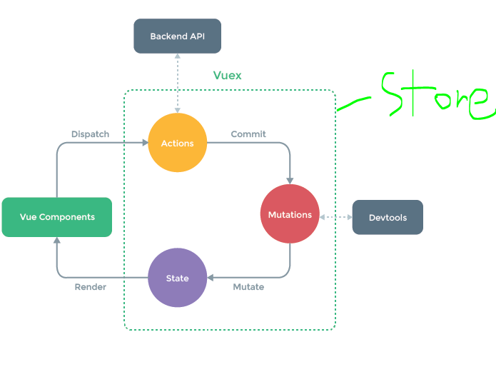

# MVVM 패턴

Model - View - ViewModel 줄임말

애플리케이션 로직과 UI의 분리를 위해 설계된 패턴으로 View 는 HTML과 CSS로 작성하고, ViewModel은 View 의 실제 

논리 및 데이터 흐름을 담당합니다.

<hr />

View : 사용자의 눈에 보이는 인터페이스

Model : 데이터 처리, 즉 데이터베이스와 통신

ViewModel : View와는 Binding, Command로 연결하고, Model과는 데이터를 주고 받는 역할

<hr />

View에 요청이 들어오면 Command를 통해 ViewModel로 보낸다.

ViewModel은 Model에 데이터를 요청한다. 그리고 Model은 데이터를 응답한다.

이를 받은 ViewModel은 필요한만큼 가공한다.

View는 ViewModel과의 Data Binding을 통해 데이터를 자동으로 갱신한다.

<br />
<br />

# Vue 인스턴스

```javascript
var simple = new Vue({ // Vue 인스턴스
    el : '#simple',  // el 옵션
    data : model  // data 옵션
})
```

data 옵션은 Vue 인스턴스가 관찰하는 데이터 객체를 의미하므로 변경 사항은 즉시 감지됩니다.

내장 옵션들은 이름 충돌을 피하기 위해 $ 식별자를 붙입니다.

```javascript
vm.$el 
vm.$data 
```

el옵션은 Vue 인스턴스에 연결할 HTML DOM 요소를 지정합니다.

주의할 점은 여러개를 지정할 수 없다는 점입니다.

실행 도중 동적으로 Vue 인스턴스와 HTML 요소를 연결할 수 있지만, 가능하다면 el 옵션은 Vue

인스턴스를 생성할 때 미리 지정할 것을 권장합니다.

<a href="http://127.0.0.1:5500/ch06/example/03-02.html" target="_blank">예제 보기</a>

<br />
<br />


# 관찰 속성

계산된 속성인 computed와 비슷한 역할을 하는 것이 있습니다. 바로 watch 입니다. 

VueJS 공식 문서에서 이 둘을 비교한 세션을 따로 정리할 정도로 이 둘은 하는 역할이 비슷합니다. 

정확히 이야기하면 하는 역할이 비슷하다기 보다는 어떻게 사용하느냐에 따라 watch가 computed의 역할까지도 할 수 

있습니다. 주로 긴 처리 시간이 필요한 비동기 처리에 적합하다는 특징을 가지고 있습니다.

<br />
<br />

# Vue 인스턴스 라이프 사이클

- Vue 인스턴스는 객체로 생성되고, 데이터에 대한 관찰 기능을 설정하는 등 작업을 위해 초기화 수행

| 라이프사이클훅 | 설명 | 
|---------|:---|
| `beforeCreate` | vue 인스턴스가 생성되고 데이터에 대한 관찰 기능 및 이벤트 감시자 설정 전에 호출됩니다. |
| `created` |  vue 인스턴스가 생성된 후에 데이터에 대한 관찰기능<br>계산적속성, 메서드,감시자 설정이 완료된 후 호출됩니다. |
| `beforeMount` | 마운트가 시작되기 전에 호출됩니다. |
| `mounted` | el에 vue 인스턴스에 데이터가 마운트된 후 호출됩니다. |
| `beforeUpdate` | 가상 DOM이 렌더링,패치되기 전에 데이터가 변경될 때 호출<br>이 훅에서 추가적인 상태 변경을 수행할 수 있음, 하지만 추가적으로 다시 렌더링 되지 않음 |
| `updated` | 데이터의 변경으로 가상 DOM이 다시 렌더링되고 패치된 후에 호출<br>이 훅이 호출되었을때는 이미 컴포넌트의 DOM이 업데이트된 상태<br>DOM에 종속성이 있는 연산을 이단계에서 수행할 수 있음. |
| `beforeDestory` | Vue 인스턴스가 제거되기 전에 호출됩니다. |
| `destory` | Vue 인스턴스가 제거되기 전에 호출됩니다. 이 훅 호출될 때는 Vue 인스턴스의 모든 디렉티브의 바인딩이 해체되고 이벤트 연결도 모두 제거 |

<br />
<br />

## 6.5 props와 event

Vue 컴포넌트들의 부모 - 자식 관계로 형성되었을 때 각 컴포넌트 내부의 데이터는 캡슐화 되기 때문에 다른 컴포넌트나 

앱에서 접근할 수 없습니다.

따라서 부모 컴포넌트에서 자식 컴포넌트에 필요한 정보를 전달하기 위해서는 속성(props)을 이용하고, 주의할 점은 부모에서

자식은 단방향으로만 전달이 가능하다는 점입니다.

<br />

반대로 자식 컴포넌트에서 부모 컴포넌트로의 전달은 이벤트를 이용합니다.

자식 컴포넌트에서 사용자 정의 이벤트를 필요한 정보와 함께 발신(emit)하면 부모 컴포넌트에서 v-on 디렉티브를 이용해서

이벤트를 처리합니다.

<br />

컴포넌트 속성을 표기할 때는 주의할 점이 있습니다.

컴포넌트 작성 시 속성명을 부여할 때는 카멜 표기법을 사용하고 태그에서는 속성명을 사용할 정보를 전달할 때는 케밥 

표기법을 사용해야 합니다.

<br />
<br />

## 6.6 이벤트 버스 객체를 이용한 통신

부모 - 자식 관계가 아닌 더 깊은 단계의 형제 또는 손자와 증손자 관계인 컴포넌트들 사이에서도 정보를 전달할 때는

이벤트 버스(Event Bus) 객체를 만들어서 전달합니다.

비어 있는 Vue 인스턴스를 만들어서 사용하면 되고, 이벤트를 수신하는 컴포넌트는 미리 이벤트 핸들러를 등록해야

합니다.

```html
var eventBus = new Vue();
```

이를 위해 Vue 인스턴스 생명주기의 created 이벤트 훅을 이용하여 Vue 인스턴스가 만들어 질 때 $on 메서드를 사용

해 이벤트 수신 정보를 등록해둡니다.

이벤트를 발신하는 컴포넌트에서는 $emit 메서드를 호출 합니다.

<a href="http://127.0.0.1:5500/ch06/example/06-24.html" target="_blank">예제 보기</a>
<br />

<a href="http://127.0.0.1:5500/ch06/example/06-28.html" target="_blank">예제 보기</a>

<br />
<hr />
<br />

# 11.1 왜 Vuex 를 사용하는가?

```html
<!DOCTYPE html>
<html>
<head>
  <meta charset="utf-8">
  <title>06-13</title>
  <script src="https://unpkg.com/vue@2.5.16/dist/vue.js"></script>
</head>
<template id="listTemplate">
    <li>{{myMessage}}</li>  <!-- 속성명 선언 시 = 카멜 표기법 -->
</template>
<script type="text/javascript">
Vue.component('list-component', {
    template : '#listTemplate',
    props : [ 'myMessage' ]  // 속성명 선언 시 = 카멜 표기법
})
</script>
<body>
<div id="app">
    <ul>
        <list-component my-message="Hello"></list-component> <!-- 속성명 전달 시 = 케밥 표기법 -->
        <list-component my-message="씬짜오"></list-component>
        <list-component my-message="니하오마"></list-component>
    </ul>
</div>
</body>
<script type="text/javascript">
var vm = new Vue({
    el : "#app"
})
</script>
</html>
```

Vue 컴포넌트는 자신만의 상태(state: data 옵션)를 포함하지만 이는 구조가 깊어지면 컴포넌트 간에 props 를

전달하는 것도 상태를 변경을 위한 이벤트 발신 및 수신도 복잡해지고 유지관리가 사실상 불가능해집니다.

그래서 사용하는 것이 이벤트 버스(Event Bus) 객체 입니다.

이벤트 버스는 관리하고자 하는모든 애플리케이션의 상태 정보를 최상위 부모 컴포넌트 또는 주요 거점 컴포넌트에

작성하고 자식 컴포넌트로 속성(props)을 이용해 전달하여 화면에 나타냅니다.

```그림 11-03```

하지만 이는 문제가 자식 컴포넌트들의 게층 구조가 복잡해질 경우 일일이 부모 컴포넌트에서 저장된 정보를 계층

구조를 따라 속성(props)으로 전달해야하고 특히 유지보수 중에서 새로운 상태 정보가 data 옵션에 추가되면 최종

자식 컴포넌트까지 전달되는 경로에 있는 모든 컴포넌트들의 속성(props) 옵션이 모두 변경되어야 합니다.

<hr />

이를 해결하기 위해 생각해볼 수 있는 방법은 전역 객체를 만들어서 각 컴포넌트에서 참조하여 사용하는 방법입니다.

```
project : ch11_01
```

전역 객체를 필요한 컴포넌트에서 import 하여 로컬 컴포넌트의 데이터 옵션으로 사용가능하며, 전역 객체는 참조형

이므로 여러 컴포넌트에서 참조하여 사용할 경우 모두 동일한 객체를 가르킵니다.

그러므로 한 컴포넌트에서 데이터를 변경하면 전역 상태가 변경되어 다른 컴포넌트의 View를 함께 갱신합니다.

하지만 이 방법도 문제가 있습니다. 

Vue 는 데이터(상태)를 중심으로 움직이는 MVVM 모델이기 때문에 상태(데이터)가 바뀌면 ViewModel 객체가 바라보고

있다가 감지하여 UI를 자동으로 변경하는데 문제는 컴포넌트가 많거나 단계가 깊을 경우 어디서 바뀌었는지 감지하기

어렵습니다.

```
- Vue 의 기본 컴포넌트 통신 방식인 상위 - 하위(부모 - 자식)간의 통신은 같은 레벨(형제) 컴포넌트끼리 통신이

안된다는 단점

- 이를 보완하는 통신 방식이 이벤트 버스이지만 상태 정보 변경의 히스토리 추적이 안되는 단점 및 오류 발생의 

가능성이 다분함
```

이러한 이유로 Vuex와 같은 상태 관리 라이브러리를 사용합니다.

```
- 중앙 집중화된 상태 정보 관리가 필요하다.

- 상태 정보가 변경되는 상황과 시간을 추척하고 싶다.

- 컴포넌트에서 상태 정보를 안전하게 접근하고 싶다.
```

그렇다고 모든 애플리케이션 개발 시에 Vuex와 같은 상태 관리 라이브러리를 사용해야만 하는 것은 아닙니다.

간단한 구조의 애플리케이션이라면 Event Bus 객체의 사용 정도로도 충분히 해결될 수 있습니다.

# 11.2 Vuex 란?

Vuex 는 Vue.js 애플리케이션 상태 관리 패턴을 지원하는 라이브러리이며, 다른 상태관리 패턴이나 라이브러리와

비교했을 때 Vue 의 Reactivity 체계를 효율적으로 활용하여 화면 업데이트가 가능하다는 차이점이 있다.

```
Vue 와 성격이 유사한 프론트엔드 프레임워크인 React 에서는 이미 Redux, Flux 와 같은 상태 라이브러리를 

사용하고 있고, Vue 도 Vuex 라는 상태관리 라이브러리를 사용한다.
```

각 컴포넌트가 공유하는 상태 데이터는 전역에서 저장소(store) 객체를 통해서 관리합니다.

이와 같은 방식으로 부모에서 자식으로 또 그 자식으로 props를 이용해 속성을 계속 전달하지 않아도 되고, 

상태 데이터를 변경하기 위해 부모 컴포넌트로 이벤트를 발생시키지 않아도 됩니다.



화살표가 한쪽 방향으로만 흘러감 -> <b>단방향 데이터 흐름</b> = 상태 변화와 추적이 용이

전체적인 흐름은 다음과 같습니다.

```
1. 컴포넌트가 액션(Action)을 일으킵니다. (ex: 버튼을 누른다)

2. 액션에서는 외부 API를 호출한 뒤 그 결과를 이용해 변이(Mutation)을 일으킵니다. (만일 외부 API가 없다면 생략)

3. 변이에서는 액션의 결과를 받아 상태(State)를 변경합니다. 이 단계는 추적이 가능하므로 Vue.js DevTools와 같은 

도구를 이용하면 상태 변경의 내역을 모두 확인 가능합니다.

4. 변이에 의해 변경된 상태는 다시 컴포넌트에 바인딩되어 화면을 갱신합니다.
```

저장소가 상태(State:데이터), 변이(Mutation), 액션(Action: methods) 을 모두 관리합니다.

저장소는 애플리케이션의 상태를 중앙집중화하여 관리하는 컨테이너이며 일반적인 전역 객체와는 달리 저장소의 상태를

직접 변경하지 않고, 반드시 변이(Mutation)를 통해서만 변경합니다.

```
Vue.js DevTools의 상태변경 사전, 사후 스냅샷
```

주의해야할 점은 변이의 목적은 상태의 변경이므로 상태의 변경과 관련이 없는 작업은 변이 내부에서 수행하지 않도록

해야 합니다. 또한 변이는 동기적인 작업이므로 비동기 처리는 변이를 통해서 수행하지 않습니다.

변이 내부에서 비동기적 처리를 수행해도 애플리케이션의 기능 자체에는 문제가 없지만, 사후 스냅샷을 캡쳐한 뒤 나중

에 상태가 변경되기 때문에 데이터가 어떻게 변경되었는지 추적을 할 수 없습니다.

상태 변화와 관련이 없는 작업은 액션(Action) 을 정의해서 실행하여 비즈니스 로직이 실행되도록 합니다. 그후 액션의

처리 결과가 변이를 호출할 때 전달하여 상태(State)를 변경합니다.

전체적인 흐름은 위에 그림대로 

```
1. Vue 컴포넌트가 나타내는 UI는 저장소의 상태(State)를 반영하고

2. UI에서 발생하는 행위는 액션(Action) 을 통해 외부 API를 요청하고

3. API 실행 결과를 통해서 다시 상태를 변화시킵니다.
```

# 11.3 상태와 변이

상태(stete)와 변이(Mutation)는 Vuex 저장소(Store) 내부의 핵심 요소입니다.

상태는 애플리케이션에서 관리해야 할 중요한 데이터이며, 변이는 상태를 변경하는 함수들을 보유하는 객체입니다.

Vuex의 요소는 다음과 같습니다.

```
1. Dispatch()

Vue컴포넌트는 Dispatch(‘[action메소드명]’)를 통해 Vuex store의 Action 그룹에 속한 메서드를 실행시킬 수 있습니다. 

2. Actions
API서버 통신과 같은 역할을 수행하는 메소드 그룹입니다.
주로 state에 반영하기 전 데이터를 조회하고 가공하는 역할을 수행합니다. 

3. Commit()
Action메소드 혹은 Vue컴포넌트에서 Commit(‘[mutation메소드명]’)을 통해 Mutation 그룹에 속한 메서드를 실행할 수 있습니다.
컴포넌트에서는 $store.commit(), Actions 메소드에서는 첫번째 인자로 넘겨받는 context.commit()으로 트리거시킵니다. 

4. Mutations
Vuex store의 상태(state)를 변경시키기 위한 메서드 집합입니다.
Vuex는 state의 조작은 오로지 Mutation의 메소드를 통해 수행하길 권장합니다.
따로 mutate 메서드는 없고, 첫 번째 인자로 받는 state.[state요소]로 수정합니다. 

5. state
사용자가 정의한 상태를 저장합니다
즉각반응형이기 때문에 v-model 의 computed 메서드중 get()이 선언되어 있다면 즉각적으로 반응합니다.
Vue컴포넌트의 watch처럼 $store.watch로 변화를 감지하고 핸들링할 수 있습니다. 

6. getters
여러 컴포넌트에서 동일한 computed를 통해 하나의 state를 가져와야 한다면 Vuex store에 getters를 등록하여 computed처럼 활용할 수 있습니다.
첫 번째 인자로 state를 받습니다. 

7. modules
하나의 스토어만을 사용해 모든 Dispatch, Commit을 처리한다면 전역 이벤트 버스와 다를 것이 없습니다.
따라서 각 목적에 맞는 항목을 module로 분리할 수 있고 namespaced속성을 true로 설정하여 각 모듈의 이름을 포함한 Dispatch, Commit, state조회 등을 수행할 수 있습니다. 
```

## 11.3.1 상태와 변이 적용 예제

```
yarn add vuex 또는 npm install -g vuex
```
```
project : todolistapp
```

```
Constant.js

변이를 일으킬 때 문자열 정보를 전달하기 때문에 미리 상수로 정의해두고 사용하면 오타를 줄일 수 있으며, 이 파일만

확인해도 애플리케이션에서 어떤 변이나 액션이 일어나는지 한눈에 알 수 있기 때문에 사용을 권장합니다.
```

```
/todolistapp/src/store/index.js
/todolistapp/src/main.js
/todolistapp/src/components/List.vue
/todolistapp/src/components/InputTodo.vue
```

## 11.3.2 헬퍼 메서드

```
/todolistapp/src/components/List.vue
```

# 11.4 게터

게터는 저장소(stroe) 수준의 계산형 속성이라고 말할 수 있습니다.

컴포넌트에서 계산형 속성이 필수가 아니듯이 게터 또한 저장소 내에서 필수적으로 사용해야 하는 것은 아니지만 

적절하게 사용하면 컴포넌트에서의 코드 작성이 편리해집니다.

```그림 11-10```

Vuex Store 객체에 전체 데이터만 있는 경우라면 데이터를 가져가는 각 컴포넌트에서 직접 가공해서 써야하는

불편함이 생기고 불필요한 코드 중복이 발생합니다.

이를 해결하기 위해서 Vuex Store 객체에서 게터를 정의해두면 각 컴포넌트에서 불필요한 작업을 하지 않아도 

되며 유지보수가 편리해집니다.

```
vue create countryapp
cd countryapp

yarn add vuex lodash 또는 npm install -g vuex lodash
```

# 11.5 액션

## 11.5.1 액션 이용하기

변이(Mutation)는 상태를 변경할 수 있지만 동기적인 작업만 수행한다는 단점이 있습니다.

그래서 변이의 기능에서 외부 리소스 액세스를 비롯한 비동기 처리가 필요한 API 호출 기능을 

수행하기 위해 액션(Action)을 분리해낼 수 밖에 없습니다.

## 11.5.2 액션을 이용한 비동기 처리

```
yarn add axios vuex es6-promise

npm install axios vuex es6-promise
```